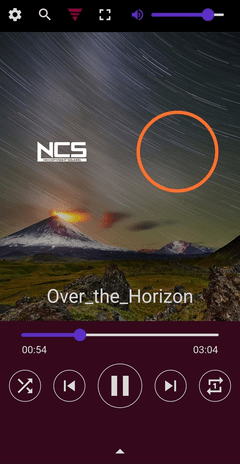

# FlutPlayer
> An Android application for playing audio.



- **Audio**
  - Playback slider
  - Play / Pause
  - Skip to next, skip to previous
  - Shuffle, repeat playback modes
  - Mashup mode
  - Volume control
- **Playlist**
  - Sort list, reset list
  - Move tracks (drag and drop)
  - Remove tracks (swipe)
- **Tags(PlayList)**
  - Load selected tags into the playlist
  - Add, update, and delete tags
  - Favorite tags feature
  - Save tags to the database
- **Equalizer**
  - Adjust gain values of bands
  - Smooth slider movement
- **Background**
  - Select background files from local files
  - Set background rotation, zoom, and color filtering options
  - Adjust background brightness
  - Default animated background
- **NCS (NoCopyrightSounds) Visualizer**
  - 15 Color settings
- **Settings**
  - Tags, sorting, mashup, equalizer, background, visualizer
  - Export/Import database and CSV files
- **Other Features**
  - Background process support
  - Notification bar UI

## Stack
- Flutter

### Dependency
- just_audio: ^0.9.35
- audioplayers: ^5.2.0
- file_picker: ^6.0.0
- permission_handler: ^11.0.1
- audio_service: ^0.18.12
- sqflite: ^2.3.0
- sqflite_common_ffi: ^2.3.0
- shared_preferences: ^2.2.2
- video_player: ^2.8.2

app/
│
├── components/: Functional UI widgets
│   ├── action_button.dart: Audio player control button widget
│   ├── background.dart: Background widget
│   ├── fade_inout_widget.dart: Fade-in/out animation widget
│   ├── optional_visibility.dart: Widget visibility control widget
│   ├── stream_builder.dart: StreamBuilder builder function class
│   ├── tag_export_dialog.dart: Tag export dialog function
│   └── visualizer.dart: Audio visualizer widget
│
├── models/: Classes and constant data
│   ├── api.dart: API result class
│   ├── color.dart: Color data class
│   ├── data.dart: Audio-related classes
│   └── enum.dart: Constant enums
│
├── screens/: Layout UI widgets
│   ├── background_select.dart: Background selection page UI widget
│   ├── bottom.dart: Bottom section UI widget
│   ├── center.dart: Center section UI widget
│   ├── drawer.dart: Page drawer UI widget
│   ├── equalizer.dart: Equalizer control UI widget
│   ├── item_add_actions.dart: Audio-specific options selector UI widget
│   ├── list_sheet.dart: Music playlist sheet UI widget
│   ├── tag_select.dart: Tag selection page UI widget
│   └── top_menu.dart: Top section UI widget
│
├── utils/: Utility classes and methods
│   ├── audio_handler.dart: Background audio service class
│   ├── audio_manager.dart: Audio management singleton class
│   ├── audio_player.dart: Interface class between external audio packages and AudioManager
│   ├── database_interface.dart: Interface class between external database packages and DatabaseManager
│   ├── database_manager.dart: Database management singleton class
│   ├── playlist.dart: Playlist management singleton class
│   ├── preference.dart: Settings management singleton class
│   └── stream_controller.dart: StreamController provider class
│
├── widgets/: Common widgets
│   ├── button.dart: Button widget
│   ├── checkbox.dart: Checkbox widget
│   ├── dialog.dart: Dialog functions
│   ├── listtile.dart: ListTile widget
│   ├── scrollbar.dart: Scrollbar widget
│   ├── slider.dart: Slider widget
│   ├── switch.dart: Switch button widget
│   ├── text.dart: Text widget
│   └── text_field.dart: Text field widget
│
├── global.dart: Global properties & methods
└── main_page.dart: Main layout UI

# FlutPlayer
> 음원을 재생하는 안드로이드 애플리케이션입니다.


- 오디오
	- 재생 슬라이더
	- 재생 / 일시정지
	- 다음 트랙 이동, 이전 트랙 이동
	- 셔플, 반복 재생 모드
	- mashup 모드
	- 볼륨 조절
- 재생 목록
	- 목록 정렬, 목록 초기화
	- 음원 이동 (드래그 앤 드랍)
	- 음원 제거 (스와이프)
- 태그
	- 선택한 태그를 재생 목록으로 불러오기
	- 태그 추가, 업데이트, 삭제
	- 태그 즐겨찾기 기능
	- 데이터베이스 저장
- 이퀄라이저
	- 밴드의 게인 값 조절
	- 스무스 슬라이더 이동
- 배경
	- 로컬 파일 내 배경 파일 선택 가능
	- 이미지 배경 회전, 확대/축소, 색상 필터링 여부 설정
	- 배경 밝기 조절
	- 기본 애니메이션 백그라운드
- NCS(NoCopyrightSounds) 비주얼라이저
	- 15가지 색상 설정
- 설정
	- 태그, 정렬, mashup, 이퀄라이저, 배경, 비주얼라이저
	- 데이터베이스, CSV 파일 내보내기 / 불러오기
- 기타
	- 백그라운드 프로세스 지원
	- 알림바 UI 제공

## Stack
- Flutter

### Dependency
- just_audio: ^0.9.35
- audioplayers: ^5.2.0
- file_picker: ^6.0.0
- permission_handler: ^11.0.1
- audio_service: ^0.18.12
- sqflite: ^2.3.0
- sqflite_common_ffi: ^2.3.0
- shared_preferences: ^2.2.2
- video_player: ^2.8.2

## Structure
```
app/
│
├── components/: 기능 UI 위젯
│   ├── action_button.dart: 오디오 플레이어 컨트롤 버튼 위젯
│   ├── background.dart: 백그라운드 위젯
│   ├── fade_inout_widget.dart: 페이드 인/아웃 애니메이션 위젯
│   ├── optional_visibility.dart: 위젯 가시성 설정 위젯
│   ├── stream_builder.dart: StreamBuilder 빌더 함수 클래스
│   ├── tag_export_dialog.dart: 태그 내보내기 다이얼로그 함수
│   └── visualizer.dart: 오디오 비주얼라이저 위젯
│
├── models/: 클래스, 상수 데이터
│   ├── api.dart: API 결과 클래스
│   ├── color.dart: 색상 데이터 클래스
│   ├── data.dart: 오디오 관련 클래스
│   └── enum.dart: 상수 enum
│
├── screens/: 레이아웃 UI 위젯
│   ├── background_select.dart: 배경 선택 페이지 UI 위젯
│   ├── bottom.dart: 하단 섹션 UI 위젯
│   ├── center.dart: 센터 섹션 UI 위젯
│   ├── drawer.dart: 페이지 드로어 UI 위젯
│   ├── equalizer.dart: 이퀄라이저 컨트롤 UI 위젯
│   ├── item_add_actions.dart: 오디오별 옵션 선택기 UI 위젯
│   ├── list_sheet.dart: 음악 재생 목록 시트 UI 위젯
│   ├── tag_select.dart: 태그 선택 페이지 UI 위젯
│   └── top_menu.dart: 상단 섹션 UI 위젯
│
├── utils/: 유틸리티 클래스 및 메서드
│   ├── audio_handler.dart: 백그라운드 오디오 서비스 클래스
│   ├── audio_manager.dart: 오디오 관리 싱글톤 클래스
│   ├── audio_player.dart: 외부 오디오 패키지, AudioManager간 인터페이스 클래스
│   ├── database_interface.dart: 외부 데이터베이스 패키지, DatabaseManager간 인터페이스 클래스
│   ├── database_manager.dart: 데이터베이스 관리 싱글톤 클래스
│   ├── playlist.dart: 재생 목록 싱글톤 클래스
│   ├── preference.dart: 설정 관리 싱글톤 클래스
│   └── stream_controller.dart: StreamController 제공 클래스
│
├── widgets/: 공통 위젯
│   ├── button.dart: 버튼 위젯
│   ├── checkbox.dart: 체크박스 위젯
│   ├── dialog.dart: 다이얼로그 함수
│   ├── listtile.dart: 리스트타일 위젯
│   ├── scrollbar.dart: 스크롤바 위젯
│   ├── slider.dart: 슬라이더 위젯
│   ├── switch.dart: 스위치 버튼 위젯
│   ├── text.dart: 텍스트 위젯
│   └── text_field.dart: 텍스트 박스 위젯
│
├── global.dart: 전역 프로퍼티 & 메서드
└── main_page.dart: 메인 레이아웃 UI
```
